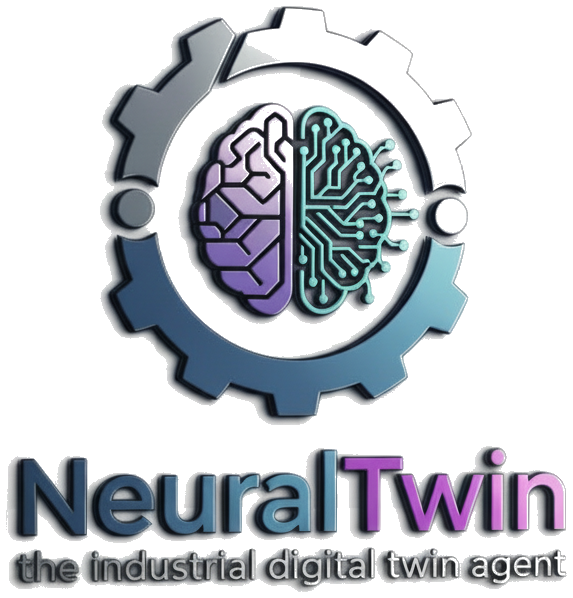
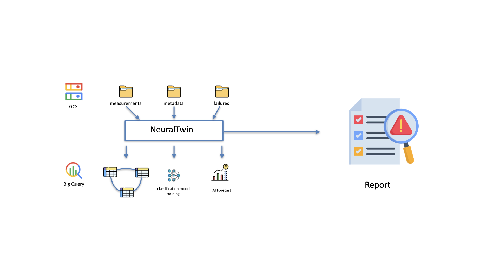

## NeuralTwin: The Industrial Digital Twin Agent

  

### **Summary (TL;DR)**

Industrial companies are drowning in sensor data but starving for insights. The high cost of unplanned downtime remains a critical problem, largely because raw data from IIoT sensors is often messy, siloed, and difficult to analyze. **neuraltwin** is an end-to-end Python agent that solves this. It ingests raw industrial data (`measurements`, `failures`, `metadata`) in any common format, automatically processes it using BigQuery, predicts future sensor data using BigQuery ML, trains a predictive failure model, and generates concise, tailored reports based on BigQuery's generative AI features. These reports summarize the previous month's performance and, most importantly, provide a clear forecast of which assets are likely to fail in the next 30 days, transforming reactive maintenance into a proactive, data-driven strategy.

### **The Inspiration: From Data Chaos to Predictive Clarity**

The core idea for `neuraltwin` came from a simple observation: most industrial data science projects fail at the "last mile." While collecting sensor data is easier than ever, turning it into actionable intelligence that an operator or plant manager can actually use is incredibly difficult. Teams spend months wrestling with:
*   **Data Heterogeneity:** Measurements in CSV, failure logs in Parquet, asset metadata in JSON—all with different schemas.
*   **Complex Modeling:** Building, training, and deploying time-series or classification models requires specialized expertise.
*   **Actionability Gap:** A Jupyter notebook with a 95% accuracy score doesn't prevent a machine from failing. The insights need to be delivered to the right person, in the right format, at the right time.

We wanted to build an agent that automates this entire workflow, using the serverless power of Google Cloud and BigQuery to create a scalable, no-fuss solution.

### **What It Does: The Four-Step Process**

Neuraltwin operates in a simple, automated four-step pipeline:

1.  **Ingest & Synthesize:** The agent takes raw data files for measurements, failures, and asset metadata. It is format-agnostic, capable of handling CSV, Parquet, JSON, and more. It intelligently infers schemas and loads them into structured, queryable tables within BigQuery.
2.  **Analyze & Train with BQML:** Once the data is centralized in BigQuery, the agent uses trains a classification model (e.g., Boosted Tree Classifier). This "digital twin" model learns the complex patterns that precede an asset failure.
3.  **Forecast & Explain:** neuraltwin uses bigquery's ai.forecast to predict future sensor values. Based on the trained model, neuraltwin then scores all active assets to predict the probability of failure over the next 30 days.
4.  **Report & Deliver:** The agent generates polished, concise reports tailored to different stakeholders.

### **How We Built It: Technical Architecture**

We leveraged the power and scalability of the Google Cloud ecosystem, with BigQuery as the central nervous system.

*   **Data Lake & Warehouse (Google Cloud Storage & BigQuery):** Raw data files are landed in a GCS bucket. Our Python script uses the BigQuery client library to load this data, automatically detecting schemas and creating tables. This provides a robust, serverless data warehouse.
*   **Model:** The model was built using the low-code library pycaret. In the future, we would like to transition to BigQuery's  `CREATE MODEL` statement in order to have the full pipeline cloud-native and leverage BigQuery's full big data capabilities.
*   **Orchestration (Python & Kaggle Notebooks):** The entire end-to-end logic is contained within a Python script, designed to run in a Kaggle Notebook or any Python environment. We used libraries like `pandas` for initial data wrangling and `google-cloud-bigquery` to interact with BQ.
*   **Data Flow:**
    `Raw Files (GCS) -> BigQuery Tables -> Model Training -> BQML Prediction -> Results Queried by Python Agent -> Report Generation`

    